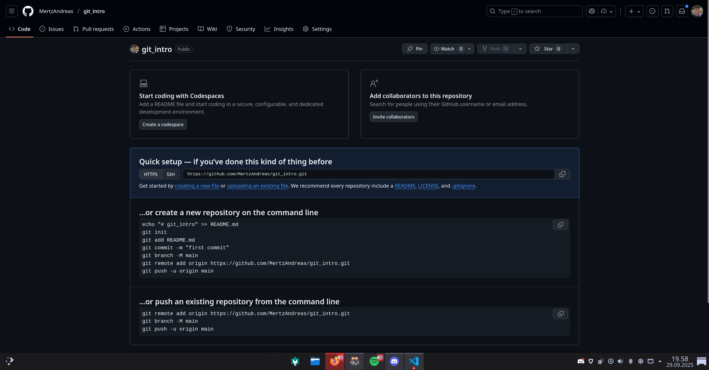

# Github Intro
## Install Git CLI

1. Windows: [Download](https://git-scm.com/) and run the installer. Click “Next” to accept the recommended settings. This will install Git and Git Bash.  

2. macOS (choose one method):  
   - **Homebrew  (Recommended)**: Download Homebrew from [brew.sh](https://brew.sh/) and follow the installation instructions. Then, open Terminal and run `brew install git`. 
   - **Xcode Command Line Tools**: Your Mac may have Git pre-installed. Open Terminal and run `git --version` to check. If not installed, you will be prompted to install the Xcode Command Line Tools when you run a Git command for the first time.
3. Linux: Open your terminal and use your package manager. For example, on Ubuntu:  
   ```bash
   sudo apt-get install git
   ```

Ensure Git is installed by running the following command in your terminal or Git Bash:
```bash
git --version
```

This should display the installed Git version, something like `git version 2.43.1` or similar.

## What is Git
Git is a tool that helps developers track changes in their code and manage different versions of a project. Every developer has a full copy of the project on their own computer, so they can work independently. Git allows changes to be merged later, but on its own, it does not provide a central place for everyone to share their work.

## What is GitHub 
GitHub is a web-based platform that uses Git for version control. It acts as a central place where developers can share their projects, collaborate, and review each other's code. While Git manages the versions and history of your project locally, GitHub makes it easy for teams to work together and keep everyone’s changes in sync. It is the most widely used service for hosting Git repositories.

## Configuring name and email
After installing Git, you need to set up your identity so that your commits are properly attributed to you. Open your terminal or Git Bash and run the following commands, replacing the placeholders with your actual name and email address:
```bash
git config --global user.name "Your Name"
git config --global user.email "you@example.com"
```
This means that changes you make to repositories will be associated with this name and email. More info can be found at [Github Documentation Username & Email](https://docs.github.com/en/get-started/git-basics/setting-your-username-in-git).

## Creating a GitHub Account
1. Go to [GitHub](https://github.com/) and click on "Sign up" in the upper right corner.
2. Follow the prompts to create a new account. Make sure to use your University Email, as this allows you to access student benefits via [Github Education](https://docs.github.com/en/education/about-github-education/github-education-for-students/apply-to-github-education-as-a-student).

## Connecting Git with GitHub
### Recommended: Personal Access Token (PAT) 
For Windows beginners, using a Personal Access Token (PAT) is simpler and avoids configuring the SSH agent. Go to [GitHub Personal Access Tokens](https://github.com/settings/tokens) and click on "Generate new token". Select the scopes you need (for basic usage, `repo` is usually sufficient). Generate the token and copy it. You will use this token as your password when pushing to GitHub from the command line. Make sure to store it securely, as you won't be able to see it again. More info can be found at [Creating a personal access token](https://docs.github.com/en/authentication/keeping-your-account-and-data-secure/creating-a-personal-access-token).

### SSH Keys 
Another way to authenticate is by using SSH keys. Go to [GitHub SSH Keys](https://github.com/settings/keys) and click on "New SSH key". Instructions on how to generate an SSH key can be found [here](https://docs.github.com/en/authentication/connecting-to-github-with-ssh). Mainly focus on ["Generating a new SSH key and adding it to the ssh-agent"](https://docs.github.com/en/authentication/connecting-to-github-with-ssh/generating-a-new-ssh-key-and-adding-it-to-the-ssh-agent).

## Initializing a Local Repository

### Locally 
1. Open your terminal or Git Bash.
2. Navigate to the directory where you want to create your project using the `cd` command
3. Run the following command to initialize a new Git repository:
   ```bash
   git init
   ```
4. This will create a hidden `.git` folder in your project directory, which Git uses to track changes. This folder contains all the necessary metadata for the repository and can be viewed by running `ls -a` in your terminal, which shows dotfiles/hidden files.
5. Add a new file to your project, like a txt or markdown file, write something in it, and save it.
6. To check the status of your repository and see the new file, run:
   ```bash
   git status
   ```
   Which will always show you which files are staged (will be committed), unstaged (changed but will not be committed), and untracked (new files that Git isn't tracking yet).
7. To stage the new file for commit, run:
   ```bash
   git add filename.txt
   ```
   Replace `filename.txt` with the actual name of your file. You can also stage all new files at once by running `git add -A`. 
8. To commit the staged changes, run:
   ```bash
   git commit -m "Initial commit"
   ```
   Making a commit is like taking a snapshot of all the changes you have staged. The `-m` flag allows you to associate a message with the commit. Replace `"Initial commit"` with a message that describes your changes.

9. The next step is to push the changes to a remote repository on GitHub. We will cover that in the next section.

### On GitHub
1. Log in to your GitHub account.
2. Click the "New" icon or [go to](https://github.com/new) in the upper right corner and select "New repository".
3. Fill in the repository name, description (optional), and choose between public visibility. Do not initialize the repository with a README file, .gitignore, or license for this example.
4. Click "Create repository".
5. After creating the repository, you will see instructions to connect your local repository to GitHub. For this project i got: 

For me i would connect via (Note that this is for my specific repository, your URL will be different):
```bash
git remote add origin https://github.com/MertzAndreas/git_intro.git
git branch -M main
git push -u origin main
```

## Quick Cheatsheet/Standard workflow
The first time you clone a repository, you need to use the `git clone` command. This creates a local copy of the repository on your computer. You only need to do this once per repository.
```bash
# Download repository (Note: HTTPs and SSH versions differ)
git clone <repo_url>  
```


```bash
git status           # See changes
git add <file>       # Stage a file
git commit -m "msg"  # Commit staged changes
git push             # Send to remote
git pull             # Get latest changes from remote (Note that this also does a merge if there are changes)
```


## Sane Github configurations (Optional)
```bash
git config --global init.defaultBranch main
```

## More Information and Resources (Optional)
- [GitHub Desktop](https://desktop.github.com/) - A user-friendly GUI for managing Git repositories. (I don't use nor understand it, but some people like it)
- [W3Schools Git Tutorial](https://www.w3schools.com/git/git_glossary.asp?remote=github) - Comprehensive down to earth tutorial on Git and GitHub basics.
- [GitHub Documentation](https://docs.github.com/en/get-started/using-github/connecting-to-github#making-more-complex-changes-in-the-browser) - Official GitHub documentation for more complex changes.
- [Git Branching](https://learngitbranching.js.org/) - Learn git visually and interactively, great for understanding branching and merging. Might be a bit advanced for beginners, but very useful. 
